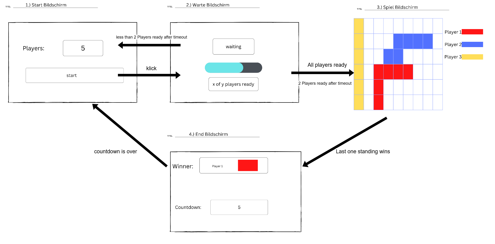
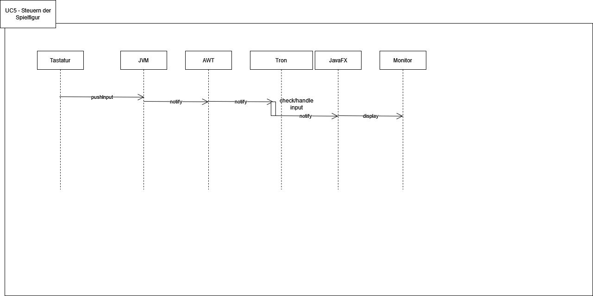
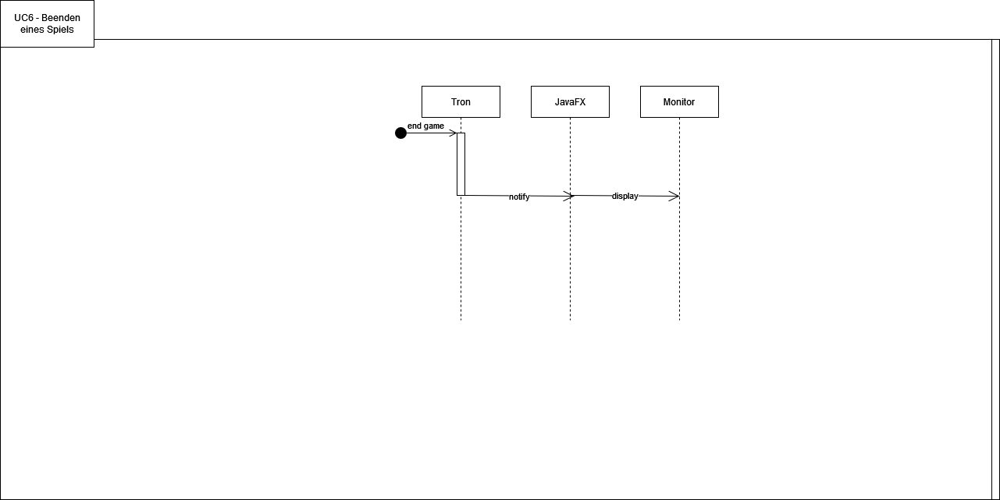
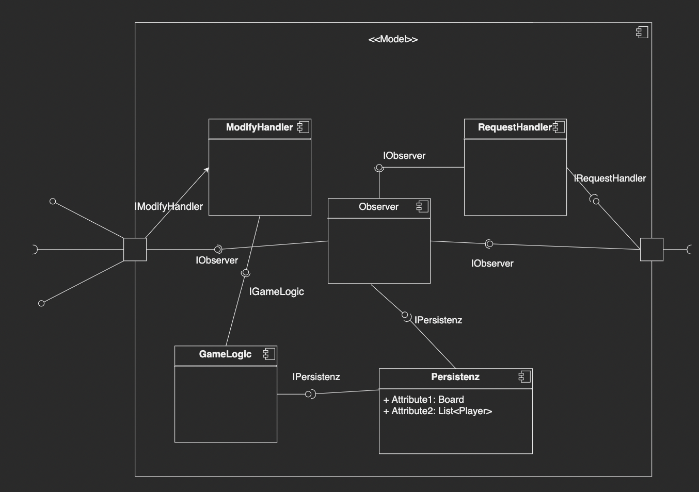

# Einführung und Ziele {#section-introduction-and-goals}

## Aufgabenstellung {#_aufgabenstellung}

::: formalpara-title
**Inhalt**
:::

Tron-Spiel nach dem Vorbild von [Tron Legacy](https://de.wikipedia.org/wiki/Tron:_Legacy) (2010) als einfache
2D-Animation.
Im folgenden werden nun Bildschirm Skizzen gezeigt, welche zeigen sollen wie das Spiel am Ende funktionieren soll.

Es wird häufig auf eine Config Datei verweisen.
Im Abschnitt "Config Tabelle" werden alle vom User änderbaren Parameter gezeigt inklusive deren zulässigen Wertebereich
und auf welchen Spielabschnitt sich der jeweilige Wert auswirkt.

Vorab eine Übersicht der Bildschirme und deren Übergänge und danach eine Detailansicht.

**Übersicht**


**Detail**

**Startbildschirm**

<ul>
<li>Der User kann zuerst auswählen wie viel Spieler (2-6) mitspielen sollen. Ein Defaultwert kann in der Config gesetzt werden.</li>
<li>Klickt der User auf start, so gelangt er zum Bildschirm 2</li>
</ul>

| Abgeleitete Methode                           | Semantische Beschreibung                                                                                                                                                                                                                                                            | Auslöser                         | Rückgabewert                                  | Methoden Nr | Bemerkung                   |   |   |   |   |
|-----------------------------------------------|-------------------------------------------------------------------------------------------------------------------------------------------------------------------------------------------------------------------------------------------------------------------------------------|----------------------------------|-----------------------------------------------|-------------|-----------------------------|---|---|---|---|
| private String init()                         | Aus dem Feld "Anzahl" wird die Zahl eingelesen. Danach wird geprüft, ob die Zahl zwischen 2 und 6 liegt. Sollte dies nicht der Fall sein, soll eine dementsprechende Fehlermeldung anzeigt werden. Ansonsten wird die Initialisierung der Spieler und des Spielfeldes vorgenommen.  | start()                          | Fehlermeldung beginnend mit "Error" oder "ok" | 1.1         |                             |   |   |   |   |
| private void changeView(int displayDescriber) | Der Bildschirm wird je nach "displayDescriber" gewechselt                                                                                                                                                                                                                           | start()                          |                                               | 1.2         | für alle Views erforderlich |   |   |   |   |
| public void start()                           | ruft die Methoden init und danach changeView auf. Sollte init einen Fehler melden wird start abgebrochen.                                                                                                                                                                           | User klickt auf den Button start |                                               | 1.3         |                             |   |   |   |   |


<ul>
<li>Danach muss der User warten bis alle weiteren Spieler bereit sind</li>
<li>Eine Anzeige soll zeigen wie viele Spieler bereit sind und auf wie viele gewartet wird.</li>
<li>Sollte ein Spieler zu lange brauchen um beizutreten, dann wird ohne ihn gespielt (timeout)</li>
<li>Die maximale Wartezeit kann in der Config Datei angegeben werden</li>
<li>Die Anwendung wechselt zu Bildschirm 3 sobald alle Spieler bereit sind</li>
<li>Sollten z.B. aufgrund von timeouts weniger als 2 Spieler am Ende der Wartezeit übrig bleiben, so wird das Spiel abgebrochen und die Anwendung wechselt zu Bildschirm 1</li>
</ul>

| Abgeleitete Methode | Semantische Beschreibung | Auslöser | Rückgabewert | Methoden Nr | Bemerkung |
| --- | --- | --- | --- | --- | --- |
| private int startTimer(int milliseconds) | startet den Timer | startWaiting | void | 2.1 |     |
| private boolean updateReadyCount(int playersReady, int ) | Die Anzeige im Bildschirm aktualieseren "x of y players ready". Passt auch den Ladebalken an. | startWaiting | true -> allReady, false -> still wait | 2.2 | Observer? |
| private int getMaxTime() | liest die maximaleWartezeit aus. | startWaiting |     | 2.3 |     |
| private void startGame() | wechselt zum Bildschirm 3 | startWaiting |     | 2.4 |     |
| public void startWaiting() | regelt die Reihenfolge aller Methoden in dem Wartebildschirm. Behandelt auch Fehlerfälle. Erfolgszenario: getMaxTime,startTimer,while(!timerDone){updateReadyCount,if(all_ready):startGame}, Fehlerfall: timerdone && readyCount&lt;2 -&gt; abort; changeView(1) | View 2 -> onLoad |     | 2.5 |     |


<ul>
<li>Das Spielfeld soll durch ein Raster repräsentiert werden.

<ul>
    <li>
    Die größe eines Rasterpunktes ist konfigurierbar.
    </li>
    <li>
    Die Anzahl der Rasterpunkte in vertikaler und horizontaler Richtung ist konfigurierbar.
    </li>
</ul>

</li>


<li>
Es existiert eine Legende mit der Spielernummer und Farbe.
</li>
<li>
Vor Spielbeginn soll ein 3 Sekunden Countdown ablaufen.
</li>
<li>
Die Spielfigur bewegt sich immer mit jedem "Tick".
<ul>
<li>Die Geschwindigkeit ist konfigurierbar.</li>
<li>
Wenn der Spieler weder nach rechts noch nach links lenkt, so bewegt sie sich in dieselbe Richtung wie vorher. 
<span style="color:red">Achtung schwamming formuliert!</span>.
</li>

</ul>
<li>Collidiert eine Spielfigur entweder mit einem anderen Spieler, der Wand oder dem Schatten eines Spielers (auch seinem Eigenen) so stirbt sie.</li>
<li>Sobald die Spielfigur stirbt, verschwindet ihr Schatten</li>
<li>Der Gewinner ist der Spieler dessen Figur als letztes überlebt (last one standing)</li>
<li>Sollten mehrere Spieler als letztes gleichzeitig ausscheiden, so ist es ein unentschieden</li>
<li>Wenn ein Spieler ausscheidet, so läuft das Spiel ohne ihn weiter, er sieht aber trotzdem noch den Bildschirm 3</li>
<li>ist das Spiel vorbei so, wechselt die Anwendung zum Bildschirm 4</li>
</ul>


<ul>
<li>Im Endbildschirm wird der Gewinner angezeigt</li>
<li>Es läuft ein Countdown ab. Dieser ist konfigurierbar.</li>
<li>Nach Ablauf des Countdowns wechselt die Anwendung zum Bildschirm 1</li>

</ul>

**Config Tabelle**

Parameter die in einer Config Datei gesetzt werden können.

| Parameter                             	| Wertebereich 	| Bildschirm 	|
|---------------------------------------	|--------------	|------------	|
| Standardspieler Anzahl                	| 2...6        	| 1          	|
| maximale Wartezeit in ms              	| 100...300000 	| 2          	|
| Größe eines Rasterpunktes in px       	| 10 ... 100   	| 3          	|
| Anzahl der Rasterpunkte Horizontal    	| 10 ... 20    	| 3          	|
| Anzahl der Rasterpunkte Vertikal      	| 10 ... 20    	| 3          	|
| Geschwindigkeit in Punkte pro Sekunde 	| 1 ... 500    	| 3          	|
| Taste rechts Spieler 1                	| tastatur     	| 3          	|
| Taste links Spieler 1                 	| tastatur     	| 3          	|
| Taste rechts Spieler 2                	| tastatur     	| 3          	|
| Taste links Spieler 2                 	| tastatur     	| 3          	|
| Taste rechts Spieler 3                	| tastatur     	| 3          	|
| Taste links Spieler 3                 	| tastatur     	| 3          	|
| Taste rechts Spieler 4                	| tastatur     	| 3          	|
| Taste links Spieler 4                 	| tastatur     	| 3          	|
| Taste rechts Spieler 5                	| tastatur     	| 3          	|
| Taste links Spieler 5                 	| tastatur     	| 3          	|
| Taste rechts Spieler 6                	| tastatur     	| 3          	|
| Taste links Spieler 6                 	| tastatur     	| 3          	|
| Countdown Ende in Sekunden            	| 3 ... 10     	| 4          	|

### Usecases
#### UC1: Ändern der Spielerzahl

- Akteur: Spieler/Nutzer
- Ziel: Spieleranzahl eingestellt
- Auslöser: Nutzer will defaultwert der Spieleranzahl nicht nutzen
- Vorbedingung: Die Anwendung ist gestartet, der Spieler sieht den Startbildschirm
- Nachbedingung: Spielerzahl ist geändert und Spieler können geladen werden / auf Spieler kann gewartet werden
- Erfolgsszenario:
    1. Das System zeigt den Startbildschirm an.
       a. Das System sorgt dafür, dass das Eingabefeld sichtbar und klickbar ist.
    2. Das System lädt den Default Wert aus der Config Datei
    3. Das System prüft den Default Wert
    3. Der Spieler klickt auf das Eingabefeld.
    4. Der Spieler tippt die gewünschte Spielerzahl ein.
    5. Das System prüft ob die Eingabe gültig ist. Gültig ist sie genau dann wenn, es eine ganze Zahl zwischen 2 und 6
       ist.
    6. Das System gibt eine Ausgabe, dass die Eingabe erfolgreich war.
    7. Das System zeigt die eingebene Zahl im Eingabefeld an.
    8. Das System speichert die Anzahl.
- Fehlerfälle:
    - iii, v. Die Eingabe ist nicht gültig
      a. Das System zeigt eine Fehlermeldung an : "Die Eingabe muss eine ganze Zahl zwischen 2 und 6 sein".
      b. Die Eingabe wird nicht angenommen. Die Spielerzahl bleibt unverändert.
- Häufigkeit: immer
- Zugrundeliegende Anforderungen: keine

#### UC2: Starten eines Spiels

- Akteur: Spieler/Nutzer
- Ziel: Spieler kann Spiel starten
- Auslöser: Spieler will ein Spiel starten
- Vorbedingung: Die Anwendung ist gestartet, der Spieler sieht den Startbildschirm
- Nachbedingung: Das Spiel ist gestartet, die Wartephase läuft
- Erfolgsszenario:
    1. Das System zeigt den Startbildschirm an.
       a. Das System sorgt dafür, dass der "Start-Button" sichtbar und klickbar ist.
    2. Der Spieler klickt auf den "Start-Button".
    3. Das System wechselt zum Wartebildschirm
- Fehlerfälle:
    - ii. Der Spieler klickt nicht auf den "Start-Button"
      a. Das System zeigt eine Fehlermeldung an : "Bitte klicken Sie auf den Start-Button".
      b. Das System bleibt auf dem Startbildschirm.*
- Häufigkeit: immer
- Zugrundeliegende Anforderungen: keine

#### UC3: Warten auf Spieler

- Akteur: Spieler/Nutzer
- Ziel: Alle Spieler sind geladen und bereit
- Auslöser: Spieler hat das Spiel gestartet
- Vorbedingung: Spiel ist gestartet und Spieler sieht den Ladebildschirm
- Nachbedingung: Initialisieren des Spielfeldes wird gestartet
- Erfolgsszenario:
    1. Das Spielfeld wird initialisiert
    2. Es werden %Sekunden% gewartet
    3. Freie Plätze werden durch KI Spieler aufgefüllt
- Fehlerfälle:
    - 1.a Fehler beim Initialisieren des Spiel feldes
        - 1.a.1 Warten wird abgebrochen und der Spieler muss das Spiel neu laden
    - 1.b Config falsch
        - 1.b.1 Der Spieler wird aufgefordert passende Werte einzugeben
    - 3.a Nicht alle KI Spieler können eingesetzt werden
        - 3.a.1 Abbruch der Initialisierung
- Häufigkeit: immer
- Zugrundeliegende Anforderungen: UC1, UC2

#### UC4: Beitreten eines Spiels

- Akteur: Spieler/Nutzer
- Ziel: Spieler ist einem Spiel beigetreten und kann auf den Beginn warten
- Auslöser: Spieler will einem Spiel beitreten
- Vorbedingung: Warten auf Spieler läuft, Spieleranzahl ist noch nicht voll
- Nachbedingung: Spieler ist beigetreten und die Runde kann starten/es wird auf weitere fehlende Spieler gewartet.
- Erfolgsszenario:
    1. Spieler drückt auf button Spiel beitreten
    2. Spieler wird verbunden, wenn noch genug Platz für ihn da ist
    3. Sobald der Spieler drin ist, wird ein Warteplatz weggenommen
- Fehlerfälle:
    - 2.a Jemand anders ist schon beigetreten
        - 2.a.1 Verbindung mit dem Spiel wird abgebrochen
    - 2.b Man hat keine Verbindung zum Spiel aufbauen können
        - 2.b.1 Verbindung wird nicht weiterhin versucht aufzubauen, der Spieler müsste dafür nochmal den button drücken
    - 2.c Spiel wird abgebrochen während des beitritts
        - 2.c.1 Die Verbindung wird nicht aufgenommen

#### UC5: Steuern der Figuren

- Akteur: Spieler/Nutzer
- Ziel: Spieler können sich auf dem Spielfeld bewegen
- Auslöser: Spieler will seine Spielfigur auf dem Spielfeld bewegen
- Vorbedingung: Spielfeld wurde init, alle Spieler sind geladen, countdown ist abgelaufen
- Nachbedingung: Die Figur hat sich in die gewünschte Richtung bewegt
- Erfolgsszenario:
    1. Spieler drückt eine der vordefinierten Tasten
    2. Spielfigur bewegt sich in die gewünschte Richtung
- Fehlerfälle:
    - 1.a Spieler drückt eine Taste die nicht definiert ist
        - 1.a.1 Die Figur bewegt sich wie zuvor
- Häufigkeit: immer
- Zugrundeliegende Anforderungen: UC2, UC3, UC4

#### UC6: Beenden des Spiels

- Akteur: Spieler/Nutzer
- Ziel: Spieler gewinnt oder verliert das Spiel
- Auslöser: Spieler will gewinnen
- Vorbedingung: Nur noch max. ein Spieler ist übrig
- Nachbedingung: Das Spiel ist beendet und der Endbildschirm wird angezeigt
- Erfolgsszenario:
    1. Spieler kollidiert (Mit einer Wand oder einem anderen Spieler oder einem Schatten)
    2. Spieler wird aus dem Spiel entfernt
    3. Es bleibt nur noch max. ein Spieler übrig
    4. Der Endbildschirm wird angezeigt
- Fehlerfälle:
    - 1.a Es wird keine Kollision erkannt
        - 1.a.1 Der Spieler wird nicht aus dem Spiel entfernt
    - 2.a Der Spieler wird nicht aus dem Spiel entfernt
        - 2.a.1 Der Spieler kann weiterhin spielen
        - 2.a.2 Der Spieler kann weiterhin andere Spieler kollidieren lassen
    - 3.a Es bleiben mehr als ein Spieler übrig
        - 3.a.1 Das Spiel läuft weiter
    - 4.a Der Endbildschirm wird nicht angezeigt
        - 4.a.1 Das Spiel läuft weiter
- Häufigkeit: immer

## Qualitätsziele {#_qualit_tsziele}

::: formalpara-title
**Inhalt**
:::

- mindestens zwei Applikationen (Gruppen) sollen miteinander spielen können
- Stabilität auch wenn andere Teilnehmer abstürzen
- Läuft immer gleich schnell (keine Jitter Abhängigkeit)
- ein Spiel am Stück reicht aus

## Stakeholder {#_stakeholder}

::: formalpara-title
**Inhalt**
:::

Expliziter Überblick über die Stakeholder des Systems -- über alle
Personen, Rollen oder Organisationen --, die

- die Architektur kennen sollten oder

- von der Architektur überzeugt werden müssen,

- mit der Architektur oder dem Code arbeiten (z.B. Schnittstellen
  nutzen),

- die Dokumentation der Architektur für ihre eigene Arbeit benötigen,

- Entscheidungen über das System und dessen Entwicklung treffen.

::: formalpara-title
**Motivation**
:::

Sie sollten die Projektbeteiligten und -betroffenen kennen, sonst
erleben Sie später im Entwicklungsprozess Überraschungen. Diese
Stakeholder bestimmen unter anderem Umfang und Detaillierungsgrad der
von Ihnen zu leistenden Arbeit und Ergebnisse.

::: formalpara-title
**Form**
:::

Tabelle mit Rollen- oder Personennamen, sowie deren Erwartungshaltung
bezüglich der Architektur und deren Dokumentation.

+-----------------+-----------------+-----------------------------------+
| Rolle | Kontakt | Erwartungshaltung |
+=================+=================+===================================+
| *\<Rolle-1>*    | *\<Kontakt-1>*  | *\<Erwartung-1>*                  |
+-----------------+-----------------+-----------------------------------+
| *\<Rolle-2>*    | *\<Kontakt-2>*  | *\<Erwartung-2>*                  |
+-----------------+-----------------+-----------------------------------+

# Randbedingungen {#section-architecture-constraints}

::: formalpara-title
**Inhalt**
:::

Randbedingungen und Vorgaben, die ihre Freiheiten bezüglich Entwurf,
Implementierung oder Ihres Entwicklungsprozesses einschränken. Diese
Randbedingungen gelten manchmal organisations- oder firmenweit über die
Grenzen einzelner Systeme hinweg.

::: formalpara-title
**Motivation**
:::

Für eine tragfähige Architektur sollten Sie genau wissen, wo Ihre
Freiheitsgrade bezüglich der Entwurfsentscheidungen liegen und wo Sie
Randbedingungen beachten müssen. Sie können Randbedingungen vielleicht
noch verhandeln, zunächst sind sie aber da.

::: formalpara-title
**Form**
:::

Einfache Tabellen der Randbedingungen mit Erläuterungen. Bei Bedarf
unterscheiden Sie technische, organisatorische und politische
Randbedingungen oder übergreifende Konventionen (beispielsweise
Programmier- oder Versionierungsrichtlinien, Dokumentations- oder
Namenskonvention).

Siehe [Randbedingungen](https://docs.arc42.org/section-2/) in der
online-Dokumentation (auf Englisch!).

# Kontextabgrenzung {#section-system-scope-and-context}

::: formalpara-title
**Inhalt**
:::

Die Kontextabgrenzung grenzt das System gegen alle Kommunikationspartner
(Nachbarsysteme und Benutzerrollen) ab. Sie legt damit die externen
Schnittstellen fest und zeigt damit auch die Verantwortlichkeit (scope)
Ihres Systems: Welche Verantwortung trägt das System und welche
Verantwortung übernehmen die Nachbarsysteme?

Differenzieren Sie fachlichen (Ein- und Ausgaben) und technischen
Kontext (Kanäle, Protokolle, Hardware), falls nötig.

::: formalpara-title
**Motivation**
:::

Die fachlichen und technischen Schnittstellen zur Kommunikation gehören
zu den kritischsten Aspekten eines Systems. Stellen Sie sicher, dass Sie
diese komplett verstanden haben.

::: formalpara-title
**Form**
:::

Verschiedene Optionen:

- Diverse Kontextdiagramme

- Listen von Kommunikationsbeziehungen mit deren Schnittstellen

Siehe [Kontextabgrenzung](https://docs.arc42.org/section-3/) in der
online-Dokumentation (auf Englisch!).

## Fachlicher Kontext {#_fachlicher_kontext}

**Inhalt**
Der Spieler interagiert mit dem Spiel über seine Maus und Tastatur und die GUI.

Es werden Visualle Informationen ausgegeben.


## Technischer Kontext {#_technischer_kontext}

::: formalpara-title
**Inhalt**





# Lösungsstrategie {#section-solution-strategy}

::: formalpara-title
**Inhalt**
:::

| Funktionssignatur                                 | Beschreibung                                                                                                               | Fehlersemantik | UC-Zugehörigkeit |
|---------------------------------------------------|----------------------------------------------------------------------------------------------------------------------------| --- |------------------|
| void setPlayerCount(int default, int playerCount) | Ändert die Anzahl an Spielern für die nächste Runde                                                                        |     | UC1              |
| void startGame()                                  | Startet das Spiel und leitet die Wartephase ein                                                                            |     | UC2              |
| void startRound()                                 | Startet den Countdown...                                                                                                   |     | UC4              |
| void startWaitPhase()                             | Prüft ob neue Spieler hinzugekommen sind und startet die Init wenn counter abgelaufen ist oder alle Spieler beisammen sind |     | UC3              |
| HashMap<String, String> loadConfig()              | Lädt aus der Conig                                                                                                         |     |                  |
| Board initializeBoard(int h, int w, int pc)       | Initialisiert das Spielfeld in der richtigen Größe mit den korrekten Kreuzen.                                              |     | UC3              |
| Board loadAssets(Board board)                     | Lädt die Spielfiguren und deren Schatten an einer zufälligen (fairen) Position auf dem Spielfeld.                          |     | UC3              |
| Board movePlayer()                                | Bewegt die Spieler in der definierten Geschwindigkeit in Blickrichtung nach vorne.                                         |     | UC5              |
| void changePlayerDirection()                      | Ändert die Richtung der Spielfigur basierend auf der Eingabe des Spielers.                                                 |     | UC5              |
| boolean checkInput()                              | Prüft auf Eingaben der Spieler. Und Sorgt für richtige "Bearbeitung".                                                      |     | UC5              |
| List<Player> calculateCollisions()                | Prüft auf eine Zusammenstoß.                                                                                               |     | UC6              |
| boolean removePlayer()                            | "Tötet" die Spieler                                                                                                        |     | UC6              |
| boolean endRound()                                | Beendet die Runde, wenn calculateCollisions keinen/einen Spieler übrig lässt.                                              |     | UC6              |
| Player setWinner()                                | Gibt den Sieger aus.                                                                                                       |     | UC6              |
| boolean joinGame()                                | Lässt Spieler einem Spiel beitreten.                                                                                       |     | UC4              |
| List<Player> getPlayersAlive()                    | Gibt eine Liste mit noch lebenden Spielern zurück.                                                                         |     | UC4              |
| void gameLoop()                                   | Klärt den ganzen Ablauf der anderen Methoden.                                                                              |     | UC4              |
| void displayBoard(Board board)                          | zeigt das Board an.                                                                               |     | UC4              |
| void displayView(View view)                          | zeigt das Board an.                                                                               |     | UC4              |

# Bausteinsicht {#section-building-block-view}

::: formalpara-title
**Inhalt**
:::

Die Bausteinsicht zeigt die statische Zerlegung des Systems in Bausteine
(Module, Komponenten, Subsysteme, Klassen, Schnittstellen, Pakete,
Bibliotheken, Frameworks, Schichten, Partitionen, Tiers, Funktionen,
Makros, Operationen, Datenstrukturen, ...) sowie deren Abhängigkeiten
(Beziehungen, Assoziationen, ...)

Diese Sicht sollte in jeder Architekturdokumentation vorhanden sein. In
der Analogie zum Hausbau bildet die Bausteinsicht den *Grundrissplan*.

::: formalpara-title
**Motivation**
:::

Behalten Sie den Überblick über den Quellcode, indem Sie die statische
Struktur des Systems durch Abstraktion verständlich machen.

Damit ermöglichen Sie Kommunikation auf abstrakterer Ebene, ohne zu
viele Implementierungsdetails offenlegen zu müssen.

::: formalpara-title
**Form**
:::

Die Bausteinsicht ist eine hierarchische Sammlung von Blackboxen und
Whiteboxen (siehe Abbildung unten) und deren Beschreibungen.


**Ebene 1** ist die Whitebox-Beschreibung des Gesamtsystems, zusammen
mit Blackbox-Beschreibungen der darin enthaltenen Bausteine.

**Ebene 2** zoomt in einige Bausteine der Ebene 1 hinein. Sie enthält
somit die Whitebox-Beschreibungen ausgewählter Bausteine der Ebene 1,
jeweils zusammen mit Blackbox-Beschreibungen darin enthaltener
Bausteine.

**Ebene 3** zoomt in einige Bausteine der Ebene 2 hinein, usw.

Siehe [Bausteinsicht](https://docs.arc42.org/section-5/) in der
online-Dokumentation (auf Englisch!).

## Whitebox Gesamtsystem {#_whitebox_gesamtsystem}

***\<Übersichtsdiagramm>***
  

  

### \<Name Blackbox 1> {#__name_blackbox_1}

Beschreiben Sie die \<Blackbox 1> anhand des folgenden
Blackbox-Templates:

- Zweck/Verantwortung

- Schnittstelle(n), sofern diese nicht als eigenständige
  Beschreibungen herausgezogen sind. Hierzu gehören eventuell auch
  Qualitäts- und Leistungsmerkmale dieser Schnittstelle.

- (Optional) Qualitäts-/Leistungsmerkmale der Blackbox, beispielsweise
  Verfügbarkeit, Laufzeitverhalten o. Ä.

- (Optional) Ablageort/Datei(en)

- (Optional) Erfüllte Anforderungen, falls Sie Traceability zu
  Anforderungen benötigen.

- (Optional) Offene Punkte/Probleme/Risiken

*\<Zweck/Verantwortung>*

*\<Schnittstelle(n)>*

*\<(Optional) Qualitäts-/Leistungsmerkmale>*

*\<(Optional) Ablageort/Datei(en)>*

*\<(Optional) Erfüllte Anforderungen>*

*\<(optional) Offene Punkte/Probleme/Risiken>*

### \<Name Blackbox 2> {#__name_blackbox_2}

*\<Blackbox-Template>*

### \<Name Blackbox n> {#__name_blackbox_n}

*\<Blackbox-Template>*

### \<Name Schnittstelle 1> {#__name_schnittstelle_1}

...

### \<Name Schnittstelle m> {#__name_schnittstelle_m}

## Ebene 2 {#_ebene_2}





| Interface Name                                 | Method                                                                                                             
|---------------------------------------------------|-----------------------------------------------------------------------------------------------------------------
| void setPlayerCount(int default, int playerCount) | Ändert die Anzahl an Spielern für die nächste Runde                                                             
| void startGame()                                  | Startet das Spiel und leitet die Wartephase ein                                                                 
| void startRound()                                 | Startet den Countdown...                                                                                        

Beschreiben Sie den inneren Aufbau (einiger) Bausteine aus Ebene 1 als
Whitebox.

Welche Bausteine Ihres Systems Sie hier beschreiben, müssen Sie selbst
entscheiden. Bitte stellen Sie dabei Relevanz vor Vollständigkeit.
Skizzieren Sie wichtige, überraschende, riskante, komplexe oder
besonders volatile Bausteine. Normale, einfache oder standardisierte
Teile sollten Sie weglassen.

### Whitebox *\<Baustein 1>* {#_whitebox_emphasis_baustein_1_emphasis}

...zeigt das Innenleben von *Baustein 1*.

*\<Whitebox-Template>*

### Whitebox *\<Baustein 2>* {#_whitebox_emphasis_baustein_2_emphasis}

*\<Whitebox-Template>*

...

### Whitebox *\<Baustein m>* {#_whitebox_emphasis_baustein_m_emphasis}

*\<Whitebox-Template>*

## Ebene 3 {#_ebene_3}

Beschreiben Sie den inneren Aufbau (einiger) Bausteine aus Ebene 2 als
Whitebox.

Bei tieferen Gliederungen der Architektur kopieren Sie diesen Teil von
arc42 für die weiteren Ebenen.

### Whitebox \<\_Baustein x.1\_\> {#_whitebox_baustein_x_1}

...zeigt das Innenleben von *Baustein x.1*.

*\<Whitebox-Template>*

### Whitebox \<\_Baustein x.2\_\> {#_whitebox_baustein_x_2}

*\<Whitebox-Template>*

### Whitebox \<\_Baustein y.1\_\> {#_whitebox_baustein_y_1}

*\<Whitebox-Template>*

# Laufzeitsicht {#section-runtime-view}

::: formalpara-title
**Inhalt**
:::

Diese Sicht erklärt konkrete Abläufe und Beziehungen zwischen Bausteinen
in Form von Szenarien aus den folgenden Bereichen:

- Wichtige Abläufe oder *Features*: Wie führen die Bausteine der
  Architektur die wichtigsten Abläufe durch?

- Interaktionen an kritischen externen Schnittstellen: Wie arbeiten
  Bausteine mit Nutzern und Nachbarsystemen zusammen?

- Betrieb und Administration: Inbetriebnahme, Start, Stop.

- Fehler- und Ausnahmeszenarien

Anmerkung: Das Kriterium für die Auswahl der möglichen Szenarien (d.h.
Abläufe) des Systems ist deren Architekturrelevanz. Es geht nicht darum,
möglichst viele Abläufe darzustellen, sondern eine angemessene Auswahl
zu dokumentieren.

::: formalpara-title
**Motivation**
:::

Sie sollten verstehen, wie (Instanzen von) Bausteine(n) Ihres Systems
ihre jeweiligen Aufgaben erfüllen und zur Laufzeit miteinander
kommunizieren.

Nutzen Sie diese Szenarien in der Dokumentation hauptsächlich für eine
verständlichere Kommunikation mit denjenigen Stakeholdern, die die
statischen Modelle (z.B. Bausteinsicht, Verteilungssicht) weniger
verständlich finden.

::: formalpara-title
**Form**
:::

Für die Beschreibung von Szenarien gibt es zahlreiche
Ausdrucksmöglichkeiten. Nutzen Sie beispielsweise:

- Nummerierte Schrittfolgen oder Aufzählungen in Umgangssprache

- Aktivitäts- oder Flussdiagramme

- Sequenzdiagramme

- BPMN (Geschäftsprozessmodell und -notation) oder EPKs
  (Ereignis-Prozessketten)

- Zustandsautomaten

- ...

Siehe [Laufzeitsicht](https://docs.arc42.org/section-6/) in der
online-Dokumentation (auf Englisch!).

## *\<Bezeichnung Laufzeitszenario 1>* {#__emphasis_bezeichnung_laufzeitszenario_1_emphasis}

- \<hier Laufzeitdiagramm oder Ablaufbeschreibung einfügen>

- \<hier Besonderheiten bei dem Zusammenspiel der Bausteine in diesem
  Szenario erläutern>

## *\<Bezeichnung Laufzeitszenario 2>* {#__emphasis_bezeichnung_laufzeitszenario_2_emphasis}

...

## *\<Bezeichnung Laufzeitszenario n>* {#__emphasis_bezeichnung_laufzeitszenario_n_emphasis}

...

# Verteilungssicht {#section-deployment-view}

::: formalpara-title
**Inhalt**
:::

Die Verteilungssicht beschreibt:

1. die technische Infrastruktur, auf der Ihr System ausgeführt wird,
   mit Infrastrukturelementen wie Standorten, Umgebungen, Rechnern,
   Prozessoren, Kanälen und Netztopologien sowie sonstigen
   Bestandteilen, und

2. die Abbildung von (Software-)Bausteinen auf diese Infrastruktur.

Häufig laufen Systeme in unterschiedlichen Umgebungen, beispielsweise
Entwicklung-/Test- oder Produktionsumgebungen. In solchen Fällen sollten
Sie alle relevanten Umgebungen aufzeigen.

Nutzen Sie die Verteilungssicht insbesondere dann, wenn Ihre Software
auf mehr als einem Rechner, Prozessor, Server oder Container abläuft
oder Sie Ihre Hardware sogar selbst konstruieren.

Aus Softwaresicht genügt es, auf die Aspekte zu achten, die für die
Softwareverteilung relevant sind. Insbesondere bei der
Hardwareentwicklung kann es notwendig sein, die Infrastruktur mit
beliebigen Details zu beschreiben.

::: formalpara-title
**Motivation**
:::

Software läuft nicht ohne Infrastruktur. Diese zugrundeliegende
Infrastruktur beeinflusst Ihr System und/oder querschnittliche
Lösungskonzepte, daher müssen Sie diese Infrastruktur kennen.

::: formalpara-title
**Form**
:::

Das oberste Verteilungsdiagramm könnte bereits in Ihrem technischen
Kontext enthalten sein, mit Ihrer Infrastruktur als EINE Blackbox. Jetzt
zoomen Sie in diese Infrastruktur mit weiteren Verteilungsdiagrammen
hinein:

- Die UML stellt mit Verteilungsdiagrammen (Deployment diagrams) eine
  Diagrammart zur Verfügung, um diese Sicht auszudrücken. Nutzen Sie
  diese, evtl. auch geschachtelt, wenn Ihre Verteilungsstruktur es
  verlangt.

- Falls Ihre Infrastruktur-Stakeholder andere Diagrammarten
  bevorzugen, die beispielsweise Prozessoren und Kanäle zeigen, sind
  diese hier ebenfalls einsetzbar.

Siehe [Verteilungssicht](https://docs.arc42.org/section-7/) in der
online-Dokumentation (auf Englisch!).

## Infrastruktur Ebene 1 {#_infrastruktur_ebene_1}

An dieser Stelle beschreiben Sie (als Kombination von Diagrammen mit
Tabellen oder Texten):

- die Verteilung des Gesamtsystems auf mehrere Standorte, Umgebungen,
  Rechner, Prozessoren o. Ä., sowie die physischen Verbindungskanäle
  zwischen diesen,

- wichtige Begründungen für diese Verteilungsstruktur,

- Qualitäts- und/oder Leistungsmerkmale dieser Infrastruktur,

- Zuordnung von Softwareartefakten zu Bestandteilen der Infrastruktur

Für mehrere Umgebungen oder alternative Deployments kopieren Sie diesen
Teil von arc42 für alle wichtigen Umgebungen/Varianten.

***\<Übersichtsdiagramm>***

Begründung

:   *\<Erläuternder Text>*

Qualitäts- und/oder Leistungsmerkmale

:   *\<Erläuternder Text>*

Zuordnung von Bausteinen zu Infrastruktur

:   *\<Beschreibung der Zuordnung>*

## Infrastruktur Ebene 2 {#_infrastruktur_ebene_2}

An dieser Stelle können Sie den inneren Aufbau (einiger)
Infrastrukturelemente aus Ebene 1 beschreiben.

Für jedes Infrastrukturelement kopieren Sie die Struktur aus Ebene 1.

### *\<Infrastrukturelement 1>* {#__emphasis_infrastrukturelement_1_emphasis}

*\<Diagramm + Erläuterungen>*

### *\<Infrastrukturelement 2>* {#__emphasis_infrastrukturelement_2_emphasis}

*\<Diagramm + Erläuterungen>*

...

### *\<Infrastrukturelement n>* {#__emphasis_infrastrukturelement_n_emphasis}

*\<Diagramm + Erläuterungen>*

# Querschnittliche Konzepte {#section-concepts}

::: formalpara-title
**Inhalt**
:::

Dieser Abschnitt beschreibt übergreifende, prinzipielle Regelungen und
Lösungsansätze, die an mehreren Stellen (=*querschnittlich*) relevant
sind.

Solche Konzepte betreffen oft mehrere Bausteine. Dazu können vielerlei
Themen gehören, beispielsweise:

- Modelle, insbesondere fachliche Modelle

- Architektur- oder Entwurfsmuster

- Regeln für den konkreten Einsatz von Technologien

- prinzipielle --- meist technische --- Festlegungen übergreifender
  Art

- Implementierungsregeln

::: formalpara-title
**Motivation**
:::

Konzepte bilden die Grundlage für *konzeptionelle Integrität*
(Konsistenz, Homogenität) der Architektur und damit eine wesentliche
Grundlage für die innere Qualität Ihrer Systeme.

Manche dieser Themen lassen sich nur schwer als Baustein in der
Architektur unterbringen (z.B. das Thema „Sicherheit").

::: formalpara-title
**Form**
:::

Kann vielfältig sein:

- Konzeptpapiere mit beliebiger Gliederung,

- übergreifende Modelle/Szenarien mit Notationen, die Sie auch in den
  Architektursichten nutzen,

- beispielhafte Implementierung speziell für technische Konzepte,

- Verweise auf „übliche" Nutzung von Standard-Frameworks
  (beispielsweise die Nutzung von Hibernate als Object/Relational
  Mapper).

::: formalpara-title
**Struktur**
:::

Eine mögliche (nicht aber notwendige!) Untergliederung dieses
Abschnittes könnte wie folgt aussehen (wobei die Zuordnung von Themen zu
den Gruppen nicht immer eindeutig ist):

- Fachliche Konzepte

- User Experience (UX)

- Sicherheitskonzepte (Safety und Security)

- Architektur- und Entwurfsmuster

- Unter-der-Haube

- Entwicklungskonzepte

- Betriebskonzepte


Siehe [Querschnittliche Konzepte](https://docs.arc42.org/section-8/) in
der online-Dokumentation (auf Englisch).

## *\<Konzept 1>* {#__emphasis_konzept_1_emphasis}

*\<Erklärung>*

## *\<Konzept 2>* {#__emphasis_konzept_2_emphasis}

*\<Erklärung>*

...

## *\<Konzept n>* {#__emphasis_konzept_n_emphasis}

*\<Erklärung>*

# Architekturentscheidungen {#section-design-decisions}

::: formalpara-title
**Inhalt**
:::

Wichtige, teure, große oder riskante Architektur- oder
Entwurfsentscheidungen inklusive der jeweiligen Begründungen. Mit
\"Entscheidungen\" meinen wir hier die Auswahl einer von mehreren
Alternativen unter vorgegebenen Kriterien.

Wägen Sie ab, inwiefern Sie Entscheidungen hier zentral beschreiben,
oder wo eine lokale Beschreibung (z.B. in der Whitebox-Sicht von
Bausteinen) sinnvoller ist. Vermeiden Sie Redundanz. Verweisen Sie evtl.
auf Abschnitt 4, wo schon grundlegende strategische Entscheidungen
beschrieben wurden.

::: formalpara-title
**Motivation**
:::

Stakeholder des Systems sollten wichtige Entscheidungen verstehen und
nachvollziehen können.

::: formalpara-title
**Form**
:::

Verschiedene Möglichkeiten:

- ADR ([Documenting Architecture
  Decisions](https://cognitect.com/blog/2011/11/15/documenting-architecture-decisions))
  für jede wichtige Entscheidung

- Liste oder Tabelle, nach Wichtigkeit und Tragweite der
  Entscheidungen geordnet

- ausführlicher in Form einzelner Unterkapitel je Entscheidung

Siehe [Architekturentscheidungen](https://docs.arc42.org/section-9/) in
der arc42 Dokumentation (auf Englisch!). Dort finden Sie Links und
Beispiele zum Thema ADR.

# Qualitätsanforderungen {#section-quality-scenarios}

::: formalpara-title
**Inhalt**
:::

Dieser Abschnitt enthält möglichst alle Qualitätsanforderungen als
Qualitätsbaum mit Szenarien. Die wichtigsten davon haben Sie bereits in
Abschnitt 1.2 (Qualitätsziele) hervorgehoben.

Nehmen Sie hier auch Qualitätsanforderungen geringerer Priorität auf,
deren Nichteinhaltung oder -erreichung geringe Risiken birgt.

::: formalpara-title
**Motivation**
:::

Weil Qualitätsanforderungen die Architekturentscheidungen oft maßgeblich
beeinflussen, sollten Sie die für Ihre Stakeholder relevanten
Qualitätsanforderungen kennen, möglichst konkret und operationalisiert.

::: formalpara-title
**Weiterführende Informationen**
:::

Siehe [Qualitätsanforderungen](https://docs.arc42.org/section-10/) in
der online-Dokumentation (auf Englisch!).

## Qualitätsbaum {#_qualit_tsbaum}

::: formalpara-title
**Inhalt**
:::

Der Qualitätsbaum (à la ATAM) mit Qualitätsszenarien an den Blättern.

::: formalpara-title
**Motivation**
:::

Die mit Prioritäten versehene Baumstruktur gibt Überblick über
die --- oftmals zahlreichen --- Qualitätsanforderungen.

- Baumartige Verfeinerung des Begriffes „Qualität", mit „Qualität"
  oder „Nützlichkeit" als Wurzel.

- Mindmap mit Qualitätsoberbegriffen als Hauptzweige

In jedem Fall sollten Sie hier Verweise auf die Qualitätsszenarien des
folgenden Abschnittes aufnehmen.

## Qualitätsszenarien {#_qualit_tsszenarien}

::: formalpara-title
**Inhalt**
:::

Konkretisierung der (in der Praxis oftmals vagen oder impliziten)
Qualitätsanforderungen durch (Qualitäts-)Szenarien.

Diese Szenarien beschreiben, was beim Eintreffen eines Stimulus auf ein
System in bestimmten Situationen geschieht.

Wesentlich sind zwei Arten von Szenarien:

- Nutzungsszenarien (auch bekannt als Anwendungs- oder
  Anwendungsfallszenarien) beschreiben, wie das System zur Laufzeit
  auf einen bestimmten Auslöser reagieren soll. Hierunter fallen auch
  Szenarien zur Beschreibung von Effizienz oder Performance. Beispiel:
  Das System beantwortet eine Benutzeranfrage innerhalb einer Sekunde.

- Änderungsszenarien beschreiben eine Modifikation des Systems oder
  seiner unmittelbaren Umgebung. Beispiel: Eine zusätzliche
  Funktionalität wird implementiert oder die Anforderung an ein
  Qualitätsmerkmal ändert sich.

::: formalpara-title
**Motivation**
:::

Szenarien operationalisieren Qualitätsanforderungen und machen deren
Erfüllung mess- oder entscheidbar.

Insbesondere wenn Sie die Qualität Ihrer Architektur mit Methoden wie
ATAM überprüfen wollen, bedürfen die in Abschnitt 1.2 genannten
Qualitätsziele einer weiteren Präzisierung bis auf die Ebene von
diskutierbaren und nachprüfbaren Szenarien.

::: formalpara-title
**Form**
:::

Entweder tabellarisch oder als Freitext.

# Risiken und technische Schulden {#section-technical-risks}

::: formalpara-title
**Inhalt**
:::

Eine nach Prioritäten geordnete Liste der erkannten Architekturrisiken
und/oder technischen Schulden.

> Risikomanagement ist Projektmanagement für Erwachsene.
>
> --- Tim Lister Atlantic Systems Guild

Unter diesem Motto sollten Sie Architekturrisiken und/oder technische
Schulden gezielt ermitteln, bewerten und Ihren Management-Stakeholdern
(z.B. Projektleitung, Product-Owner) transparent machen.

::: formalpara-title
**Form**
:::

Liste oder Tabelle von Risiken und/oder technischen Schulden, eventuell
mit vorgeschlagenen Maßnahmen zur Risikovermeidung, Risikominimierung
oder dem Abbau der technischen Schulden.

Siehe [Risiken und technische
Schulden](https://docs.arc42.org/section-11/) in der
online-Dokumentation (auf Englisch!).

# Glossar {#section-glossary}

::: formalpara-title
**Inhalt**
:::

Die wesentlichen fachlichen und technischen Begriffe, die Stakeholder im
Zusammenhang mit dem System verwenden.

Nutzen Sie das Glossar ebenfalls als Übersetzungsreferenz, falls Sie in
mehrsprachigen Teams arbeiten.

::: formalpara-title
**Motivation**
:::

Sie sollten relevante Begriffe klar definieren, so dass alle Beteiligten

- diese Begriffe identisch verstehen, und

- vermeiden, mehrere Begriffe für die gleiche Sache zu haben.

```{=html}
<!-- -->
```

- Zweispaltige Tabelle mit \<Begriff> und \<Definition>

- Eventuell weitere Spalten mit Übersetzungen, falls notwendig.

Siehe [Glossar](https://docs.arc42.org/section-12/) in der
online-Dokumentation (auf Englisch!).

+-----------------------+-----------------------------------------------+
| Begriff | Definition |
+=======================+===============================================+
| *\<Begriff-1>*        | *\<Definition-1>*                             |
+-----------------------+-----------------------------------------------+
| *\<Begriff-2*         | *\<Definition-2>*                             |
+-----------------------+-----------------------------------------------+
